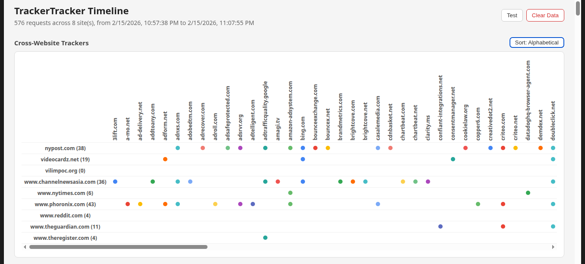
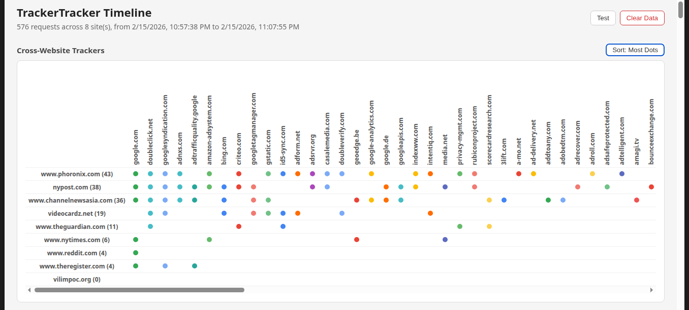
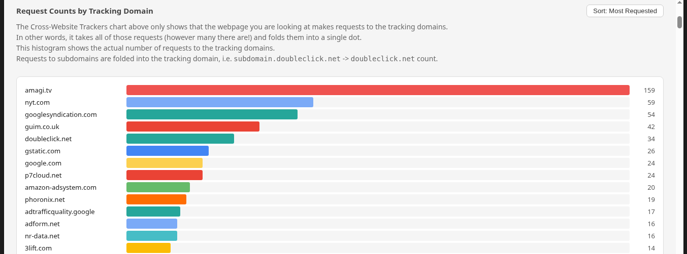
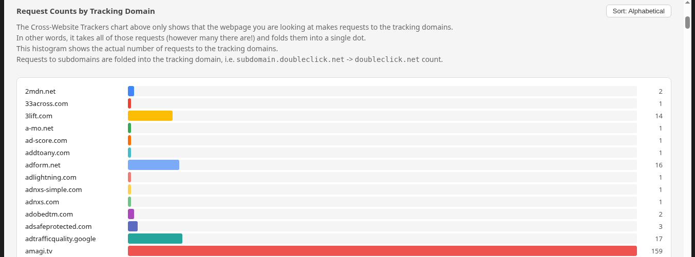
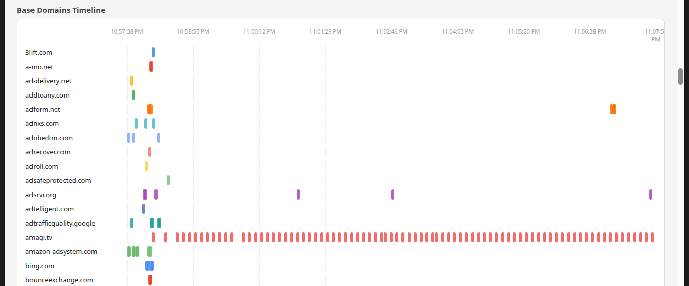
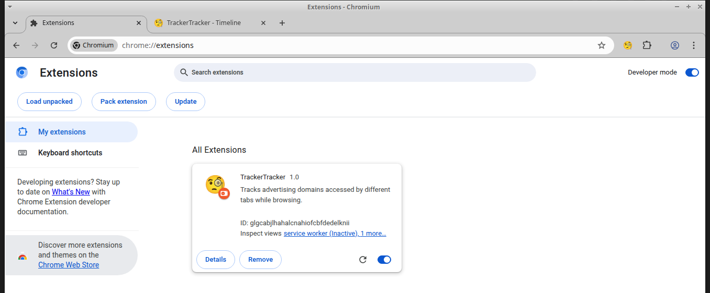

# TrackerTracker 🧐

A Chrome extension that tracks the advertising domains that different tabs access while browsing
and visualizes them using a scatter plot.

This shows the user how they are being tracked across websites, as each website fires off requests
to the same ad networks, loading tracking pixels and Javascript stubs.

There are some false positives for Content Distribution Networks (CDNs) in the current version,
and alternative domains hosting content for the browsed address, e.g. `phoronix.com` fetches
content from `phoronix.net`, `nytimes.com` pulls from `nyt.com`, etc.

Obviously these aren't advertising domains, but they'll show up anyways for now.
I'm not going to look too closely at this yet.

## Visualization

Here's what the scatter plot looks like.

Alphabetical Sort shows the browsed websites list sorted from A-Z.

Most-Dots Sort shows the browsed websites list sorted on both axes:

* by the most-to-least total number of trackers requested by a domain and
* by the most-to-least seen tracking domains

In this example, some kind of Google tracking was requested by 6 of the domains
on the left, and as you look to the right, those sites are less and less commonly
used for tracking.

## Histograms

Tracking Domains sorted by Most Requested

Tracking Domains sorted Alphabetically

## Time Series

A time series that shows how Tracking Domains are called repeatedly and often.

## Browser Tab Time Series

A time series that shows how each Browser Tab accesses various Tracking Domains.

## Installation

To install the plugin in Chrome, go to `chrome://extensions` turn on Developer Mode, and
use the `Load unpacked` button.

## License

No idea what license this thing belongs to, since it was all vibe coded with Claude.
